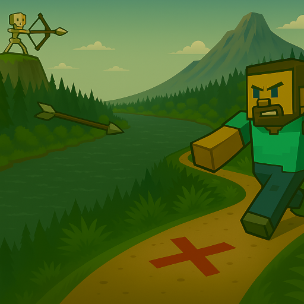

## Compatibility

Tested on Spigot-1.10, 1.14, 1.15, 1.16, 1.19, 1.20, 1.20.6, 1.21.

## Introduction

A Minecraft (Bukkit) plugin that allows to improve aiming of creatures.

## Features

* Synergies perfectly with [CustomCreatures](https://github.com/uprial/customcreatures) and [MasochisticSurvival](https://github.com/uprial/masochisticsurvival/) plugins
* Skeletons and other shooters firing projectiles (Strays having bows, Pillagers and Piglins having crossbows, Witches having potions, Ghasts, Withers, Blazes) into players with fantastic precision, considering eye position and predicting a movement target point based on the movement history.
* Totally fair and natural aiming without cheats: a projectile direction is calculated only at an aiming stage without adjustments in flight.

## Commands

`takeaim reload` - reload config from disk

## Permissions

* Access to 'reload' command:
`takeaim.reload` (default: op)

## Configuration
[Default configuration file](src/main/resources/config.yml)

## Integration from other plugins

An example of how to engage TakeAim in your plugins to target mobs at players and how to fallback when TakeAim is disabled:
[TakeAimAdapter.java](https://github.com/uprial/masochisticsurvival/blob/main/src/main/java/com/gmail/uprial/masochisticsurvival/listeners/TakeAimAdapter.java)

## Author
I will be happy to add some features or fix bugs. My mail: uprial@gmail.com.

## Useful links
* [Project on GitHub](https://github.com/uprial/takeaim/)
* [Project on Bukkit Dev](http://dev.bukkit.org/bukkit-plugins/takeaim/)
* [Project on Spigot](https://www.spigotmc.org/resources/takeaim.68713/)
* [TODO list](TODO.md)

## Related projects
* CustomBazookas: [Bukkit Dev](https://legacy.curseforge.com/minecraft/bukkit-plugins/custombazookas/) [GitHub](https://github.com/uprial/custombazookas), [Spigot](https://www.spigotmc.org/resources/custombazookas.124997/)
* CustomCreatures: [Bukkit Dev](http://dev.bukkit.org/bukkit-plugins/customcreatures/), [GitHub](https://github.com/uprial/customcreatures), [Spigot](https://www.spigotmc.org/resources/customcreatures.68711/)
* CustomNukes: [Bukkit Dev](http://dev.bukkit.org/bukkit-plugins/customnukes/), [GitHub](https://github.com/uprial/customnukes), [Spigot](https://www.spigotmc.org/resources/customnukes.68710/)
* CustomRecipes: [Bukkit Dev](https://dev.bukkit.org/projects/custom-recipes), [GitHub](https://github.com/uprial/customrecipes/), [Spigot](https://www.spigotmc.org/resources/customrecipes.89435/)
* CustomVillage: [Bukkit Dev](http://dev.bukkit.org/bukkit-plugins/customvillage/), [GitHub](https://github.com/uprial/customvillage/), [Spigot](https://www.spigotmc.org/resources/customvillage.69170/)
* MasochisticSurvival: [Bukkit Dev](https://legacy.curseforge.com/minecraft/bukkit-plugins/masochisticsurvival/), [GitHub](https://github.com/uprial/masochisticsurvival/), [Spigot](https://www.spigotmc.org/resources/masochisticsurvival.124943/)
